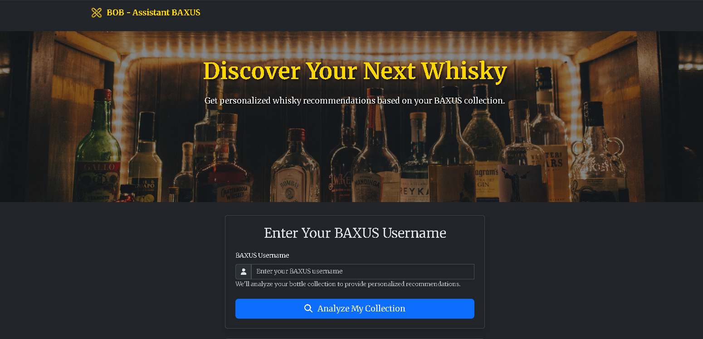

<p align="center">
  
</p>

# Bob Assistant BAXUS

A web application for personalized whisky recommendations based on your BAXUS collection.

## Features
- User profile analysis based on your BAXUS collection
- Smart recommendations for similar and complementary bottles
- Visual dashboard with carousels and insights

## LLM API Key and Endpoint

To use AI (LLM) features, you must provide:
- **LLM_API_KEY:** Your API key from the chosen provider (Groq, OpenAI, etc)
- **LLM_API_URL:** The endpoint URL of the desired LLM service

These variables should be set in the `.env` file (see the example in `.env.example`).

### Example for Groq
```
LLM_API_KEY=your-groq-key
LLM_API_URL=https://api.groq.com/openai/v1/chat/completions
```

### Example for OpenAI
```
LLM_API_KEY=your-openai-key
LLM_API_URL=https://api.openai.com/v1/chat/completions
```

You can use any compatible provider by adjusting these values.

## Installation

### Requirements
- Python 3.8+
- pip

### Setup
1. **Clone the repository:**
   ```bash
   git clone https://github.com/yourusername/assistant-bob-baxus.git
   cd assistant-bob-baxus
   ```
2. **Install dependencies:**
   ```bash
   pip install -r requirements.txt
   ```
3. **Run the application:**
   ```bash
   python app.py
   ```
4. **Access in your browser:**
   Open [http://localhost:5000](http://localhost:5000)

## Usage
- Enter your BAXUS username to get personalized whisky recommendations.
- Explore your profile, preferred brands, and spirits.
- Browse recommended bottles in an interactive carousel.

## Project Structure
```
WhiskyBob/
├── app.py
├── recommendation_engine.py
├── llm_utils.py
├── data_loader.py
├── requirements.txt
├── README.md
├── .gitignore
├── templates/
│   ├── layout.html
│   ├── index.html
│   ├── recommendations.html
│   └── error.html
└── static/
    └── ...
```

## License
MIT

---
*Developed by Grottan City Lab.*
